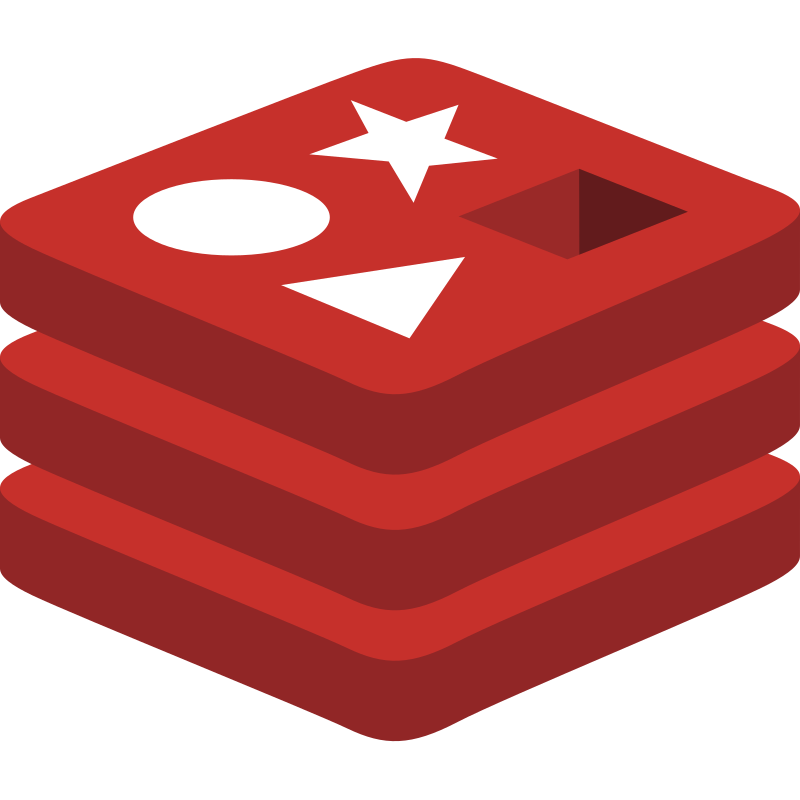

### About Me:
* В настоящее время занимаюсь backend разработкой, изучаю frontend(React)
* Мне нравится сокетное программирование и io-bound задачи, поэтому в свободное время пишу на низкоуровневых библиотеках: socket, low-level asyncio, threading... мини хобби..
* В прошлом работал сетевым инженером, поэтому имею неплохую базу по сетям
* В школьные годы увлекался разработкой в Arduino IDE

### Messengers:

## ⚡️⚡️ Languages, frameworks and Tools

### Backend:
<table>
    <thead>
        <th>Pytho</th>
        <th>Flask</th>
        <th>FastAPI</th>
        <th>Django</th>
        <th>AioHttp</th>
        <th>Gunicorn</th>
        <th>Nginx</th>
        <th>Celery</th>
        <th>Pydantic</th>
    </thead>
    <tbody>
        <td></td>
        <td></td>
        <td></td>
        <td></td>
        <td></td>
        <td></td>
        <td></td>
        <td></td>
        <td></td>
    </tbody>
</table>

### Databases:
<table>
    <thead>
        <th>SQLite</th>
        <th>PostgreSQL</th>
        <th>Redis</th>
    </thead>
    <tbody>
        <td></td>
        <td></td>
        <td></td>
    </tbody>
</table>

### Frontend:
<table>
    <thead>
        <th width=50>JavaScript</th>
        <th>HTML</th>
        <th>CSS</th>
        <th>jQuery</th>
    </thead>
    <tbody>
        <td></td>
        <td></td>
        <td></td>
        <td></td>
    </tbody>
</table>

### DevOps & Tools:
<table>
    <thead>
        <th>Docker</th>
        <th>Git</th>
        <th>Postman</th>
        <th>Wireshark</th>
        <th>VMware</th>
        <th>Selenium</th>
    </thead>
    <tbody>
        <td></td>
        <td></td>
        <td></td>
        <td></td>
        <td></td>
        <td></td>
    </tbody>
</table>

### OS
<table>
    <thead>
        <th>Linux</th>
        <th>Ubuntu</th>
        <th>RouterOS</th>
    </thead>
    <tbody>
        <td></td>
        <td></td>
        <td></td>
    </tbody>
</table>

 

